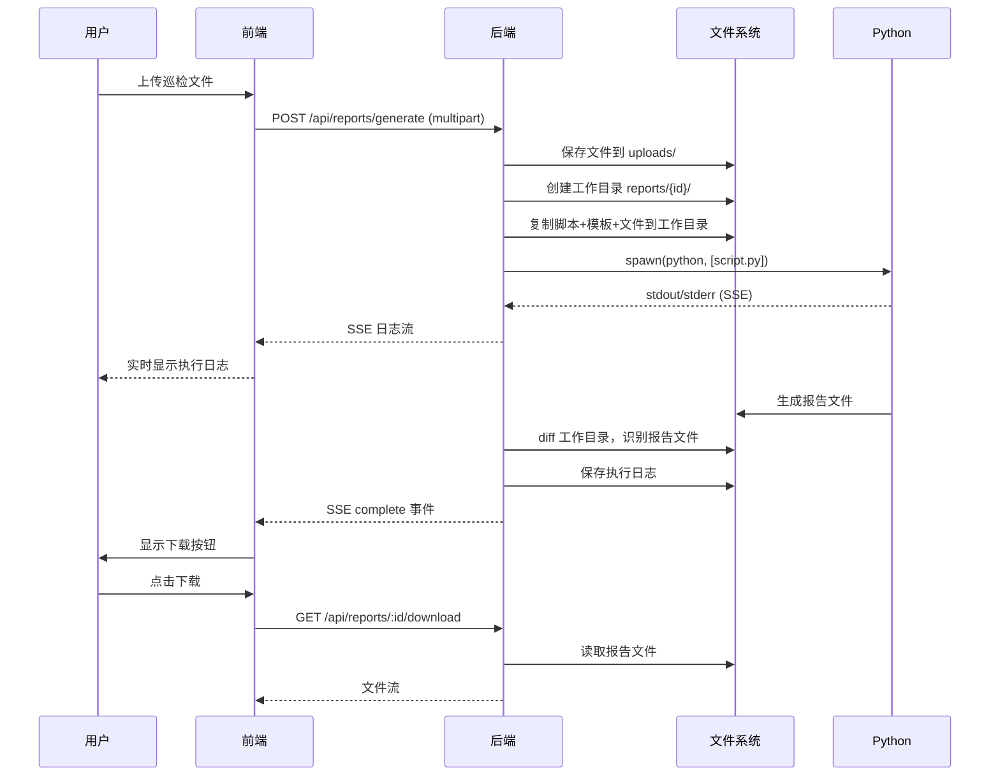

# 智能报告生成工具 - 项目全面审查报告

> **审查日期**: 2026-06-23  
> **审查人**: 齐活林（Qi）· 交付总监  
> **项目版本**: v0.3.0  
> **审查范围**: 全栈代码审查 + 架构评估

---

## 一、项目概览

### 1.1 项目定位
智能报告生成工具是一个面向 IT 运维团队的自动化巡检报告生成平台，核心能力是：**上传巡检脚本 → 批量导入巡检数据 → 后端真实执行脚本 → 自动识别并输出格式化报告**。

### 1.2 技术栈总览

| 层级 | 技术选型 | 评价 |
|------|---------|------|
| **前端框架** | React 18 + TypeScript + Vite 5 | ✅ 主流选型，合理 |
| **UI 组件** | Tailwind CSS + shadcn/ui | ✅ 现代化、可定制性强 |
| **状态管理** | Zustand | ✅ 轻量、简洁，适合中等规模应用 |
| **路由** | React Router v6 | ✅ 标准选型 |
| **后端** | Node.js 原生 http（零框架） | ⚠️ 极简但缺乏中间件生态 |
| **数据存储** | JSON 文件（db.json） | ⚠️ 简单但有并发和扩展性问题 |
| **实时通信** | SSE (Server-Sent Events) | ✅ 轻量，适合单向日志推送 |
| **Python 环境** | venv + pip | ✅ 隔离性好 |

---

## 二、架构评估

### 2.1 整体架构图

```
┌─────────────────────────────────────────────────────────────┐
│                        前端 (Vite + React)                    │
│  ┌──────────┐ ┌──────────┐ ┌──────────┐ ┌──────────────┐    │
│  │ 登录/注册 │ │ 脚本管理 │ │ 报告生成 │ │ AI 助手     │    │
│  └──────────┘ └──────────┘ └──────────┘ └──────────────┘    │
│  ┌──────────┐ ┌──────────┐ ┌──────────┐ ┌──────────────┐    │
│  │ 报告下载 │ │ 用户管理 │ │ 对话记录 │ │ 个人设置     │    │
│  └──────────┘ └──────────┘ └──────────┘ └──────────────┘    │
└─────────────────────────────────────────────────────────────┘
                              │
                         HTTP/REST + SSE
                              │
┌─────────────────────────────────────────────────────────────┐
│                    后端 (Node.js 原生 http)                    │
│  ┌──────────┐ ┌──────────┐ ┌──────────┐ ┌──────────────┐    │
│  │ 用户认证 │ │ 脚本管理 │ │ 报告生成 │ │ 模板管理     │    │
│  └──────────┘ └──────────┘ └──────────┘ └──────────────┘    │
│  ┌──────────┐ ┌──────────┐ ┌──────────┐                     │
│  │ 对话管理 │ │ 文件存储 │ │ Python   │                     │
│  │          │ │          │ │ 执行引擎 │                     │
│  └──────────┘ └──────────┘ └──────────┘                     │
└─────────────────────────────────────────────────────────────┘
                              │
                    ┌─────────┴─────────┐
                    │                   │
              ┌─────┴─────┐     ┌──────┴──────┐
              │  db.json  │     │ 文件系统    │
              │ (元数据)  │     │ (脚本/模板/ │
              │           │     │  报告/日志) │
              └───────────┘     └─────────────┘
```

### 2.2 架构优点

1. **前后端分离清晰**：前端 SPA + 后端 API，职责边界明确
2. **SSE 实时日志**：脚本执行过程实时推送，用户体验好
3. **Python venv 隔离**：每个脚本独立虚拟环境，依赖不冲突
4. **文件 hash 校验**：上传完整性验证，防止传输损坏
5. **压缩包自动解压**：tar/gz 后端自动处理，减少前端复杂度

### 2.3 架构问题

| 问题 | 严重程度 | 说明 |
|------|---------|------|
| **单文件后端** | 🔴 高 | `index.ts` 约 2150 行，所有路由、中间件、业务逻辑混在一起，可维护性差 |
| **JSON 文件数据库** | 🔴 高 | `db.json` 无并发控制，并发写入会导致数据丢失或损坏 |
| **无鉴权中间件** | 🔴 高 | API 无 Token/Session 验证，任何用户可调用任何接口 |
| **硬编码路径** | 🟡 中 | Python venv 路径硬编码为特定用户目录，可移植性差 |
| **CORS 全开放** | 🟡 中 | `Access-Control-Allow-Origin: *`，生产环境有安全风险 |
| **无错误边界** | 🟡 中 | 前端无 ErrorBoundary，运行时错误会导致白屏 |
| **无日志轮转** | 🟡 中 | `server.log` 无限增长，无大小限制和轮转机制 |

---

## 三、代码质量审查

### 3.1 后端代码 (smart-report-server/src/index.ts)

#### 优点
- ✅ 完整的 TypeScript 类型注解
- ✅ 日志系统分级（DEBUG/INFO/WARN/ERROR）
- ✅ 文件 hash 校验确保完整性
- ✅ 脚本执行超时保护（自动发送回车）
- ✅ 工作目录 diff 自动识别报告文件
- ✅ 压缩包解压支持 tar/gz

#### 问题清单

| # | 问题 | 行号 | 严重程度 | 建议 |
|---|------|------|---------|------|
| 1 | **无 API 鉴权** | 全局 | 🔴 高 | 添加 JWT/Session 中间件，验证 token |
| 2 | **命令注入风险** | 1600-1616 | 🔴 高 | `spawn` 参数未充分校验 `script.fileName`，恶意文件名可注入命令 |
| 3 | **路径遍历风险** | 多处 | 🔴 高 | `url.pathname.split('/')[3]` 直接拼接路径，需校验 `..` 等 |
| 4 | **JSON 文件并发写** | 148-150 | 🔴 高 | `writeDB` 无锁机制，并发请求会覆盖数据 |
| 5 | **密码明文传输** | 1927-1942 | 🟡 中 | 登录密码仅 SHA-256 哈希存储，无盐值，建议用 bcrypt |
| 6 | **Token 生成不安全** | 1941 | 🟡 中 | Token 仅基于 `id+username+timestamp` 的 SHA-256，可预测 |
| 7 | **硬编码管理员** | 2128-2145 | 🟡 中 | 默认密码 `Aa123456` 硬编码在代码中 |
| 8 | **文件删除无权限检查** | 1081-1101 | 🟡 中 | 任何请求都可删除任何脚本，无所有权验证 |
| 9 | **SSE 无心跳** | 1424-1755 | 🟢 低 | 长时间脚本执行可能被代理/防火墙断开连接 |
| 10 | **`url.parse()` 弃用** | 690 | 🟢 低 | Node.js 建议使用 `new URL()` |

### 3.2 前端代码

#### 优点
- ✅ TypeScript 严格模式，类型定义完整
- ✅ Zustand 状态管理简洁高效
- ✅ 组件化程度高，通用组件抽取合理
- ✅ 权限矩阵设计清晰（FeatureKey 体系）
- ✅ shadcn/ui 组件风格统一

#### 问题清单

| # | 问题 | 文件 | 严重程度 | 建议 |
|---|------|------|---------|------|
| 1 | **API 地址硬编码** | services/api.ts:1 | 🟡 中 | `http://localhost:3001` 硬编码，应使用环境变量 |
| 2 | **无全局错误处理** | App.tsx | 🟡 中 | 缺少 ErrorBoundary，运行时错误导致白屏 |
| 3 | **密码前端 SHA-256** | authService.ts | 🟡 中 | 前端哈希无意义（HTTPS 下应明文传输，后端加盐哈希） |
| 4 | **IndexedDB 双写** | stores/ | 🟡 中 | 前端 IndexedDB + 后端 db.json 双写，数据不一致风险 |
| 5 | **无请求重试** | api.ts | 🟢 低 | 网络抖动时无自动重试机制 |
| 6 | **无 loading 状态** | 部分页面 | 🟢 低 | 部分页面缺少加载状态，用户体验不完整 |

---

## 四、业务逻辑审查

### 4.1 用户认证流程

```
注册 → 待审核(pending) → 管理员审批 → 激活(active) → 登录
```

**问题**：
- ❌ 无 Token 过期机制，登录后永不失效
- ❌ 无刷新 Token，前端 localStorage 存储用户信息即可伪造身份
- ❌ 无密码强度校验（仅检查长度 >= 6）
- ❌ 无登录失败次数限制（暴力破解风险）

### 4.2 报告生成流程

```
上传巡检文件 → 选择脚本 → 选择模板 → 填写信息 → 后端执行脚本 → 识别报告文件 → 下载
```

**问题**：
- ⚠️ 脚本执行无超时限制，死循环脚本会永久占用进程
- ⚠️ 无并发控制，多个用户同时生成报告可能资源耗尽
- ⚠️ 报告文件无清理机制，磁盘空间会持续增长
- ✅ SSE 日志推送设计合理，用户体验好
- ✅ 工作目录 diff 机制巧妙，自动识别脚本产出

### 4.3 权限体系

| 角色 | 能力 |
|------|------|
| admin | 全部功能 + 用户管理 + 审批 |
| senior | 脚本管理 + 报告生成 + AI 助手 |
| member | 报告生成 + 报告下载 |

**问题**：
- ❌ 权限仅前端控制，后端 API 无鉴权，可绕过
- ❌ 无数据隔离，用户可看到所有区域的脚本和报告

---

## 五、安全风险评估

### 5.1 高风险

| 风险 | 说明 | 建议 |
|------|------|------|
| **API 无鉴权** | 所有 API 无需登录即可调用 | 实现 JWT 中间件 |
| **命令注入** | 脚本文件名未校验，可注入系统命令 | 严格校验文件名，使用白名单 |
| **路径遍历** | 文件路径拼接未校验 `..` | 使用 `path.resolve` + 白名单目录 |
| **密码存储** | SHA-256 无盐值，彩虹表可破解 | 使用 bcrypt + 随机盐值 |
| **默认密码** | 管理员密码 `Aa123456` 硬编码 | 首次登录强制修改密码 |

### 5.2 中风险

| 风险 | 说明 | 建议 |
|------|------|------|
| **CORS 全开放** | 任何域名都可跨域请求 | 限制为前端域名 |
| **无速率限制** | API 无频率限制，可被 DDoS | 添加 express-rate-limit |
| **文件上传无限制** | 仅限制文件名，无大小/类型限制 | 添加文件大小和类型白名单 |
| **日志敏感信息** | 日志可能包含密码等敏感信息 | 日志脱敏处理 |

---

## 六、功能完整性评估

### 6.1 已实现功能（PRD 对照）

| PRD 编号 | 功能 | 状态 | 备注 |
|---------|------|------|------|
| P0-1 | 用户登录 | ✅ 已实现 | 含注册+审批流程 |
| P0-2 | 多角色权限 | ✅ 已实现 | admin/senior/member |
| P0-3 | 脚本上传管理 | ✅ 已实现 | 含辅助文件、依赖配置 |
| P0-4 | 脚本列表筛选 | ✅ 已实现 | 分类+搜索 |
| P0-5 | 报告生成向导 | ✅ 已实现 | 5 步向导（超出 PRD 的 4 步） |
| P0-6 | 动态上传选项 | ✅ 已实现 | 按分类动态展示 |
| P0-7 | 拖拽上传 | ✅ 已实现 | FileUploader 组件 |
| P0-8 | 报告信息填写 | ✅ 已实现 | 含自动填充 |
| P0-9 | 内置模板 | ⚠️ 部分实现 | 支持上传模板，但内置模板库未见 |
| P0-10 | 进度展示 | ✅ 已实现 | SSE 日志流 |
| P0-11 | 报告列表下载 | ✅ 已实现 | 含筛选 |
| P0-12 | AI 智能助手 | ⚠️ 部分实现 | 页面存在，但 AI 能力需外部 API |
| P0-13 | 意图识别 | ⚠️ 部分实现 | 前端规则匹配，非真正 AI |
| P0-14 | 响应式布局 | ✅ 已实现 | Tailwind 响应式 |
| P0-15 | 登录页独立 | ✅ 已实现 | 无侧边栏 |

### 6.2 未实现功能

| 功能 | 优先级 | 复杂度 |
|------|--------|--------|
| 飞书/钉钉通知 | 高 | 低 |
| 报告定时生成 | 高 | 中 |
| 批量报告生成 | 高 | 中 |
| AI 智能分析 | 中 | 高 |
| 报告对比功能 | 中 | 中 |
| Docker 部署 | 中 | 低 |
| 邮件发送 | 低 | 中 |
| 审计日志 | 低 | 低 |

---

## 七、数据流与集成关系

### 7.1 核心数据流



### 7.2 模块依赖关系

```
前端模块依赖：
App.tsx
  ├── router/ (路由配置)
  │   ├── pages/ (页面组件)
  │   │   ├── stores/ (状态管理)
  │   │   │   └── services/ (API 调用)
  │   │   └── components/ (UI 组件)
  │   └── components/layout/ (布局组件)
  └── types/ (类型定义)
      └── constants/ (常量)

后端模块依赖：
index.ts (单文件)
  ├── 配置常量
  ├── 工具函数 (日志/DB/文件操作)
  ├── 中间件 (CORS/解析/校验)
  ├── API 路由
  │   ├── /api/users/*
  │   ├── /api/scripts/*
  │   ├── /api/templates/*
  │   ├── /api/reports/*
  │   └── /api/conversations/*
  └── Python 执行引擎
```

---

## 八、改进建议

### 8.1 高优先级（必须修复）

1. **实现 API 鉴权中间件**
   - 使用 JWT Token 验证
   - 每个 API 检查用户身份和权限
   - Token 设置过期时间（建议 24h）

2. **修复命令注入漏洞**
   - 校验脚本文件名（仅允许 `[a-zA-Z0-9_-.]`）
   - 使用 `path.resolve` + 目录白名单防止路径遍历
   - 脚本执行前检查文件类型

3. **升级密码存储**
   - 使用 bcrypt 替代 SHA-256
   - 为每个用户生成随机盐值
   - 登录失败 5 次后锁定 15 分钟

4. **解决 JSON 文件并发问题**
   - 方案 A：使用 SQLite 替代 db.json（推荐）
   - 方案 B：实现文件锁机制（如 proper-lockfile）
   - 方案 C：使用写入队列（Write-Ahead Log）

### 8.2 中优先级（建议修复）

5. **后端代码拆分**
   - 按模块拆分：routes/、middleware/、services/、utils/
   - 使用 Express/Koa 替代原生 http
   - 添加请求日志中间件

6. **前端健壮性提升**
   - 添加 ErrorBoundary 全局错误捕获
   - API 地址使用环境变量
   - 添加请求重试和超时机制

7. **安全加固**
   - CORS 限制为配置的前端域名
   - 添加文件上传大小限制（建议 100MB）
   - 实现 API 速率限制
   - 日志脱敏（不记录密码）

8. **运维改进**
   - 日志轮转（按大小或日期）
   - 添加健康检查和监控指标
   - 报告文件自动清理（保留 30 天）

### 8.3 低优先级（锦上添花）

9. **功能增强**
   - 飞书/钉钉 Webhook 通知
   - 报告定时生成（cron）
   - 批量报告生成
   - AI 智能分析集成

10. **部署优化**
    - Docker 容器化
    - CI/CD 流水线
    - 前端 CDN 加速

---

## 九、接手能力评估

### 9.1 我已理解的核心模块

| 模块 | 理解程度 | 可维护性 |
|------|---------|---------|
| 用户认证流程 | ✅ 完全理解 | 可立即修改 |
| 脚本管理 | ✅ 完全理解 | 可立即修改 |
| 模板管理 | ✅ 完全理解 | 可立即修改 |
| 报告生成流程 | ✅ 完全理解 | 可立即修改 |
| SSE 日志推送 | ✅ 完全理解 | 可立即修改 |
| Python 执行引擎 | ✅ 完全理解 | 可立即修改 |
| 前端状态管理 | ✅ 完全理解 | 可立即修改 |
| 权限体系 | ✅ 完全理解 | 可立即修改 |

### 9.2 关键文件清单

| 文件 | 用途 | 行数 |
|------|------|------|
| `smart-report-server/src/index.ts` | 后端全部逻辑 | ~2150 |
| `smart-report-tool/src/pages/ReportCreatePage.tsx` | 报告生成主页面 | - |
| `smart-report-tool/src/pages/ScriptsTemplatesPage.tsx` | 脚本/模板管理 | - |
| `smart-report-tool/src/services/api.ts` | API 调用封装 | 119 |
| `smart-report-tool/src/stores/authStore.ts` | 认证状态管理 | - |
| `smart-report-tool/src/types/index.ts` | 类型定义 | 202 |

### 9.3 可立即开展的工作

1. ✅ 修复已知 Bug（数据同步、列表重复等）
2. ✅ 添加新功能（通知、定时任务等）
3. ✅ 代码重构（后端拆分、安全加固）
4. ✅ 性能优化（缓存、并发控制）
5. ✅ 部署运维（Docker、监控、日志）

---

## 十、总结

### 项目评分

| 维度 | 评分 | 说明 |
|------|------|------|
| **功能完整性** | ⭐⭐⭐⭐ | 核心功能完整，部分高级功能待实现 |
| **代码质量** | ⭐⭐⭐ | 结构清晰但单文件后端需重构 |
| **安全性** | ⭐⭐ | 存在多个高风险漏洞，需优先修复 |
| **可维护性** | ⭐⭐⭐ | 前端良好，后端需拆分 |
| **用户体验** | ⭐⭐⭐⭐ | 向导式流程、实时日志体验好 |
| **可扩展性** | ⭐⭐⭐ | JSON 文件存储限制扩展，需迁移到数据库 |

### 一句话评价

> **这是一个功能完整、用户体验良好的运维报告生成平台，核心业务逻辑设计合理，但安全性和可维护性需要重点加固。已具备接手继续开发的条件，建议优先修复安全漏洞，然后逐步重构后端架构。**

---

*报告生成时间：2026-06-23 12:49*  
*审查人：齐活林（Qi）· 交付总监*
