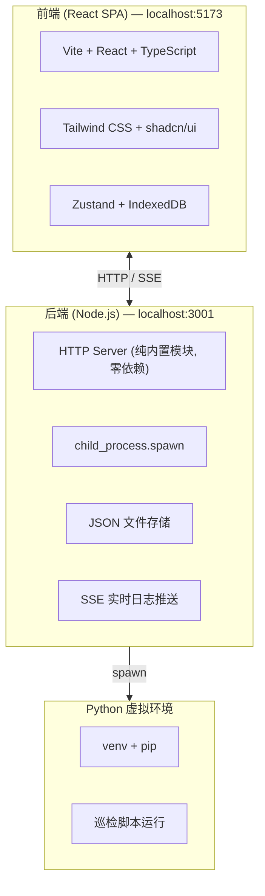

# 智能报告生成工具 v0.1.0 项目说明报告

> **版本**: v0.1.0  
> **日期**: 2026-06-15  
> **项目负责人**: 郑工  
> **状态**: 初步可用  

---

## 目录

- [1. 项目概述](#1-项目概述)
- [2. 需求背景](#2-需求背景)
- [3. 技术架构](#3-技术架构)
- [4. 项目结构](#4-项目结构)
- [5. 已完成功能](#5-已完成功能)
- [6. 未完成功能](#6-未完成功能)
- [7. 已知待修复问题](#7-已知待修复问题)
- [8. 部署与运行](#8-部署与运行)
- [9. 版本记录](#9-版本记录)

---

## 1. 项目概述

**智能报告生成工具**是一个前后端分离的 Web 应用，用于自动化处理 IT 运维巡检数据并生成格式化报告。系统支持用户上传巡检脚本和模板，批量导入巡检数据（含压缩包自动解压），在后端真实执行 Python 脚本，自动识别并提取报告输出文件。

### 核心能力

- 巡检脚本的上传、版本管理与 Python 虚拟环境配置
- 报告模板（docx/xlsx/md/pdf）的上传与管理
- 批量巡检数据导入（支持 tar/gz 自动解压）
- Python 脚本真实执行（spawn 子进程）及实时日志流推送
- 自动依赖检查与安装（pip install）
- 报告文件自动识别与下载

---

## 2. 需求背景

用户郑工是广西联通的 IT 基础设施运维人员，日常需要：

1. 对数百台 Windows 服务器定期执行巡检（Python 脚本自动化）
2. 将巡检 HTML 报告 + 服务器列表 Excel + 模板 docx 组合生成最终巡检报告
3. 团队多人协作，需要用户管理和权限控制
4. 脚本离线运行，依赖 Python 虚拟环境中的特定包

系统旨在将这些手工流程自动化、标准化，减少人工操作和出错概率。

---

## 3. 技术架构

### 3.1 总体架构



### 3.2 前端技术栈

| 技术 | 用途 |
|------|------|
| Vite 5 | 构建工具 |
| React 18 + TypeScript | UI 框架 |
| Tailwind CSS | 样式 |
| shadcn/ui | 组件库 |
| Zustand | 状态管理 |
| IndexedDB (idb v8) | 客户端持久化（离线回退） |
| JSZip + pako | 客户端压缩包解压 |
| React Router v6 | 路由 |

### 3.3 后端技术栈

| 技术 | 用途 |
|------|------|
| Node.js 内置 `http` | HTTP 服务器 |
| `child_process.spawn` | 脚本执行 |
| `fs/promises` | 文件操作 |
| JSON 文件 (`db.json`) | 元数据存储 |
| SSE (Server-Sent Events) | 实时日志推送 |

### 3.4 Python 虚拟环境

| 路径 | 说明 |
|------|------|
| `~/PycharmProjects/Windows巡检总结报告生成脚本/venv/` | Python 虚拟环境 |
| 依赖包 | python-docx, beautifulsoup4, pandas, openpyxl, lxml, pywin32 |

---

## 4. 项目结构

```
WorkBuddy/2026-06-11-15-56-59/
├── start.bat                 # Windows 一键启动脚本
├── start.ps1                 # PowerShell 启动脚本
├── stop.bat                  # Windows 一键停止脚本
├── stop.ps1                  # PowerShell 停止脚本
├── .gitignore                # Git 忽略规则
├── README.md                 # 项目说明
├── PROJECT_REPORT.md         # 本报告
│
├── smart-report-server/      # 后端项目
│   ├── src/
│   │   └── index.ts          # 所有后端逻辑（单文件）
│   ├── package.json
│   └── tsconfig.json
│
└── smart-report-tool/        # 前端项目
    ├── src/
    │   ├── pages/            # 页面组件
    │   │   ├── DashboardPage.tsx
    │   │   ├── LoginPage.tsx
    │   │   ├── RegisterPage.tsx
    │   │   ├── ReportCreatePage.tsx
    │   │   ├── ReportsPage.tsx
    │   │   ├── ScriptsTemplatesPage.tsx
    │   │   ├── SettingsPage.tsx
    │   │   ├── UsersPage.tsx
    │   │   ├── AssistantPage.tsx
    │   │   └── ConversationsPage.tsx
    │   ├── components/       # 通用组件
    │   ├── stores/           # Zustand 状态管理
    │   ├── services/         # API 服务层
    │   ├── types/            # TypeScript 类型
    │   ├── utils/            # 工具函数
    │   └── constants/        # 常量定义
    ├── package.json
    └── vite.config.ts
```

---

## 5. 已完成功能

### 5.1 用户管理
- [x] 用户注册（用户名/密码/显示名称）
- [x] 用户登录 + 状态校验（待审核/已通过/已拒绝）
- [x] 三角色权限体系：admin / senior / member
- [x] 基于 FeatureKey 的权限矩阵
- [x] 管理员审批用户 + 角色修改
- [x] 个人设置页

### 5.2 脚本管理
- [x] 脚本上传（支持 .py/.sh/.ps1/.bat）
- [x] 脚本元数据（名称/版本/类型/分类/备注）
- [x] 辅助文件上传（多文件）
- [x] Python 环境配置（手动输入依赖 + 导入 requirements.txt）
- [x] 脚本版本管理（同名多版本合并显示）
- [x] 脚本编辑（含辅助文件增删）
- [x] 脚本删除（后端+IndexedDB 双删）

### 5.3 模板管理
- [x] 模板上传（.docx/.xlsx/.md/.pdf）
- [x] 模板元数据（名称/类型/适配脚本类型）
- [x] 脚本关联模板（多模板关联）
- [x] 模板删除（后端+IndexedDB 双删）

### 5.4 报告生成流程
- [x] 5 步向导式报告创建
  1. 上传巡检数据（含压缩包 tar/gz 自动解压）
  2. 选择处理脚本（自动过滤 + 去重）
  3. 选择报告模板（自动选中关联模板 + 去重）
  4. 填写报告信息（名称/日期/作者/格式/分类）
  5. 确认生成
- [x] 输出格式支持：HTML / Markdown / DOCX
- [x] 实时日志流（SSE）显示执行过程
- [x] 压缩包自动解压（后端 tar 解析器）
- [x] Python 依赖自动检查与安装（pip list → pip install）
- [x] 脚本 stdin 自动处理（3 秒无输出自动发送回车）
- [x] 报告文件自动识别（工作目录 diff + 格式筛选）

### 5.5 报告管理
- [x] 报告列表（状态/时间/脚本/格式）
- [x] 报告下载（后端文件流）
- [x] 执行日志查看
- [x] 报告删除

### 5.6 基础设施
- [x] 前后端分离架构
- [x] CORS 支持
- [x] SSE 实时日志推送
- [x] IndexedDB 离线回退
- [x] 一键启动/停止脚本（bat + ps1）
- [x] Git 版本管理

---

## 6. 未完成功能

### 6.1 高优先级

| 功能 | 说明 |
|------|------|
| 飞书/钉钉通知 | 报告生成完成后通过 Webhook 通知团队成员 |
| 报告定时生成 | 按 cron 定时自动执行巡检脚本生成报告 |
| 批量报告生成 | 一次生成多个服务器的报告 |
| 脚本执行参数传递 | 支持在执行脚本时传入自定义参数 |

### 6.2 中优先级

| 功能 | 说明 |
|------|------|
| AI 助手增强 | 基于巡检数据的智能分析建议 |
| 报告对比功能 | 对比两个不同时期的巡检报告 |
| 图表可视化 | 巡检指标趋势图（CPU/内存/磁盘） |
| 多语言支持 | 报告模板中英文切换 |
| Docker 部署 | 前端+后端容器化部署 |

### 6.3 低优先级

| 功能 | 说明 |
|------|------|
| 邮件报告发送 | 报告生成后自动邮件发送 |
| 报告水印 | 报告中添加水印和密级标识 |
| 审计日志 | 完整的操作审计记录 |
| 数据库迁移 | 从 JSON 文件迁移到 SQLite/MySQL |

---

## 7. 已知待修复问题

### 7.1 数据同步

| 问题 | 严重程度 | 描述 |
|------|---------|------|
| 前端编辑数据未同步到后端 | 中 | 脚本/模板编辑保存到 IndexedDB 后，生成报告时后端从 `db.json` 读取的是旧数据 |
| 部分解决方案 | - | 生成报告时前端将 requirements 等关键字段直接传给后端；IndexedDB 数据优先合并显示 |

### 7.2 前端问题

| 问题 | 严重程度 | 描述 |
|------|---------|------|
| 脚本列表偶现重复 | 低 | 后端+IndexedDB 合并时可能出现同名重复，已加文件名去重 |
| 模板列表偶现重复 | 低 | 同上，已修复 `docTemplateStore` 合并逻辑 |
| 部分 shadcn/ui 组件缺少 `Description` | 低 | DialogContent 缺少 `aria-describedby`，不影响功能 |
| React Router v7 兼容性警告 | 低 | `v7_startTransition` 和 `v7_relativeSplatPath` 未来标志 |

### 7.3 后端问题

| 问题 | 严重程度 | 描述 |
|------|---------|------|
| `url.parse()` 弃用警告 | 低 | Node.js 建议改用 WHATWG URL API |
| 文件系统回退可能不完整 | 中 | 当 `db.json` 丢失时，部分脚本/模板信息可能不完整 |
| 磁盘空间未监控 | 低 | 报告文件累积可能占用大量磁盘空间 |

### 7.4 运维问题

| 问题 | 严重程度 | 描述 |
|------|---------|------|
| `start.bat` Windows 兼容性 | 低 | 部分系统上 `chcp 65001` 导致乱码，已移除 |
| Python venv 依赖安装 | 中 | 首次使用需手动运行 `install_deps.bat` 或通过后端自动安装 |
| 报告文件清理 | 低 | 生成的报告文件和日志没有自动清理机制 |

---

## 8. 部署与运行

### 8.1 环境要求

| 组件 | 版本要求 |
|------|---------|
| Node.js | >= 18 |
| Python | >= 3.8（含 venv） |
| 操作系统 | Windows 10/11 |

### 8.2 首次部署

```bash
# 1. 进入项目目录
cd smart-report-tool && npm install
cd ../smart-report-server && npm install

# 2. 创建 Python 虚拟环境并安装依赖
cd %USERPROFILE%\PycharmProjects\Windows巡检总结报告生成脚本
python -m venv venv
venv\Scripts\pip install -r requirements.txt
```

### 8.3 启动服务

```bash
# 方式一：一键启动（推荐）
双击 start.bat
# 或
powershell -ExecutionPolicy Bypass -File start.ps1

# 方式二：手动启动
# 终端1 - 后端
cd smart-report-server && npx tsx src/index.ts
# 终端2 - 前端
cd smart-report-tool && npx vite --port 5173
```

### 8.4 访问地址

- 前端: http://localhost:5173
- 后端: http://localhost:3001
- API健康检查: http://localhost:3001/api/health

### 8.5 停止服务

```bash
双击 stop.bat
# 或
powershell -ExecutionPolicy Bypass -File stop.ps1
```

---

## 9. 版本记录

| 版本 | 日期 | 说明 |
|------|------|------|
| v0.1.0 | 2026-06-15 | 首个初步可用版本 |

### v0.1.0 关键里程碑

1. 前后端分离架构搭建完成
2. 用户注册审批 + 三角色权限
3. 脚本上传/编辑/删除 + 版本管理
4. 模板上传/删除 + 脚本关联
5. 5 步向导式报告生成
6. Python 脚本真实执行 + SSE 实时日志
7. 虚拟环境集成 + 自动依赖安装
8. 压缩包自动解压
9. 报告文件自动识别与下载
10. Git 版本归档
