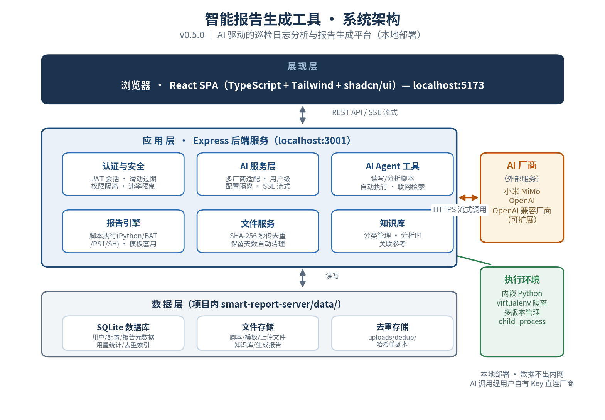

# 智能报告生成工具 - 本地部署版

> **当前版本**：v0.5.0（2026-08-07）
>
> v0.5.0 亮点：AI 分析任务后端队列化（断线恢复 + 排队 + 原地重试）、OpenCode Go 厂商接入、模型上下文/输出上限自动填充与自动探测、模型高级配置（工具调用/思考模式/思考强度）、系统日志与安全审计、知识库批量上传与表格列宽自定义。

## 系统架构

<p align="center">
  
</p>

## 一键启动（推荐）

项目根目录提供一键启动/停止脚本，自动完成依赖检查、端口冲突检测、健康等待与浏览器打开：

| 平台 | 启动 | 停止 |
|------|------|------|
| Windows (CMD) | `start.bat` | `stop.bat` |
| Windows (PowerShell) | `start.ps1` | `stop.ps1` |
| Linux / macOS | `./start.sh` | Ctrl+C 自动清理 |

首次运行会自动安装前后端依赖，并从 `.env.example` 生成后端配置文件（请按需修改 `smart-report-server/.env`）。

- 前端：`http://localhost:5173`
- 后端：`http://localhost:3001`（健康检查 `/api/health`）

## 手动启动步骤

### 1. 安装依赖

```bash
# 安装后端依赖
cd smart-report-server
npm install

# 安装前端依赖
cd ../smart-report-tool
npm install
```

### 2. 启动后端服务

```bash
cd smart-report-server
npx tsx watch src/index.ts
```

后端服务将启动在 `http://localhost:3001`

数据存储目录：`smart-report-server/data/`（数据库、脚本、模板、上传文件、生成的报告均在项目内）

### 3. 启动前端（新终端）

```bash
cd smart-report-tool
npx vite --port 5173
```

前端将启动在 `http://localhost:5173`

### 4. 使用系统

打开浏览器访问 `http://localhost:5173`，默认账号见 `docs/用户使用说明文档.md`。

## 功能说明

### AI 能力（v0.5.0 主功能）
- **AI 智能分析**：上传巡检日志（txt/log/csv/json/xlsx）流式生成分析报告；支持包模式可整包拆析 zip/tar.gz 支持包，支持用户补充提示词
- **分析任务队列**：任务服务端集中排队，刷新/断线后可恢复，支持原地重试与换模型重试
- **多厂商 AI 服务**：服务端集中管理模型配置，按用户隔离（各自配置各自使用），支持小米 MiMo、DeepSeek、Kimi、通义千问、智谱 GLM、MiniMax、零一万物、OpenAI、OpenCode Go 与自定义厂商
- **模型管理**：官方规格自动填充上下文/输出上限、实际上限自动探测、可用性测试、高级配置（工具调用/图片输入/思考模式与思考强度）、用量统计与调用记录检视
- **AI 助手**：对话式助手，可读写脚本、分析脚本、自动执行脚本（工具调用）
- **知识库**：分类管理参考文件（单文件最大 200MB、批量上传、在线下载），AI 分析时可关联参考

### 后端能力
- **脚本管理**：接收上传的 Python/BAT/PowerShell/Shell 脚本，存储在本地文件系统
- **模板管理**：接收 docx/xlsx/md/pdf 模板上传
- **文件上传**：接收巡检数据文件（支持批量上传和压缩包），SHA-256 秒传去重
- **文件清理**：按保留天数自动清理临时文件
- **脚本执行**：真实执行用户上传的脚本，使用 `child_process.spawn`
- **实时日志**：通过 SSE 流式返回脚本执行日志到前端
- **报告生成**：脚本输出 + 模板套用 → 生成最终报告文件
- **报告下载**：按格式下载生成的报告

### 数据存储（均在 `smart-report-server/data/` 下）
- SQLite 数据库：`data/smart-report.db`
- 脚本文件：`data/scripts/{scriptId}/`
- 模板文件：`data/templates/{templateId}/`
- 上传文件：`data/uploads/`（去重存储 `data/uploads/dedup/`）
- 生成报告：`data/reports/{reportId}/`

## 脚本执行流程

1. 前端上传巡检文件 → 后端存储（命中去重则秒传引用）
2. 前端选择脚本和模板 → 发送生成请求到后端
3. 后端创建临时工作目录 `reports/{reportId}/`
4. 后端将脚本、辅助文件、模板复制到工作目录
5. 后端将巡检文件映射到工作目录的 `input/` 子目录
6. 后端根据脚本类型选择执行命令：`python`/`bash`/`powershell` 等
7. 后端通过 SSE 实时推送执行日志到前端
8. 脚本执行完成后，后端根据输出格式生成报告文件
9. 前端下载生成的报告文件

## 环境要求

- Node.js 18+
- Python 3.x（如果要执行 Python 脚本；项目内嵌 Python 环境自动管理）
- PowerShell（如果要执行 .ps1 脚本）
- Bash（如果在 Linux/Mac 上执行 .sh 脚本）

## 更多文档

- 用户使用说明：`docs/用户使用说明文档.md`
- 系统设计：`docs/system_design.md`
- 启动指南：`STARTUP_GUIDE.md`
- 功能更新记录：`功能更新说明-2026-08-04.md`
