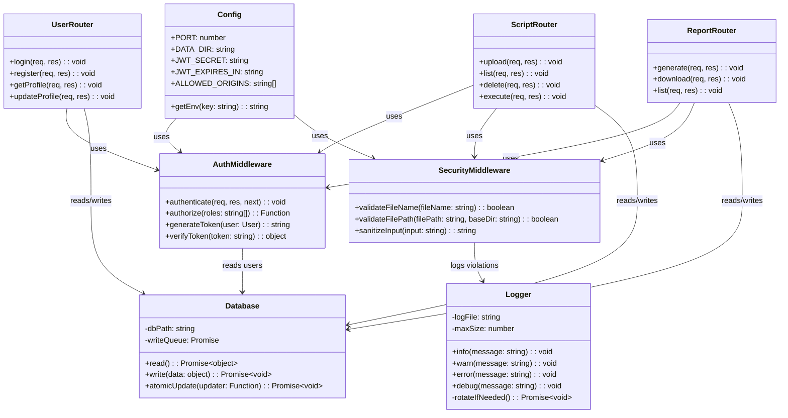
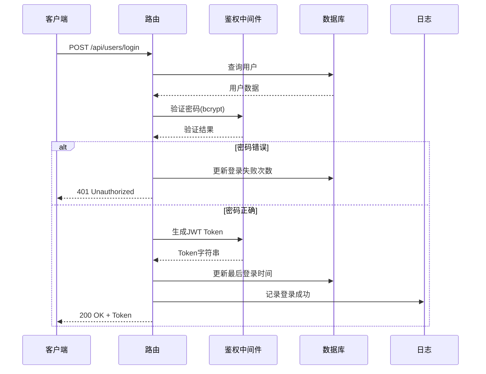
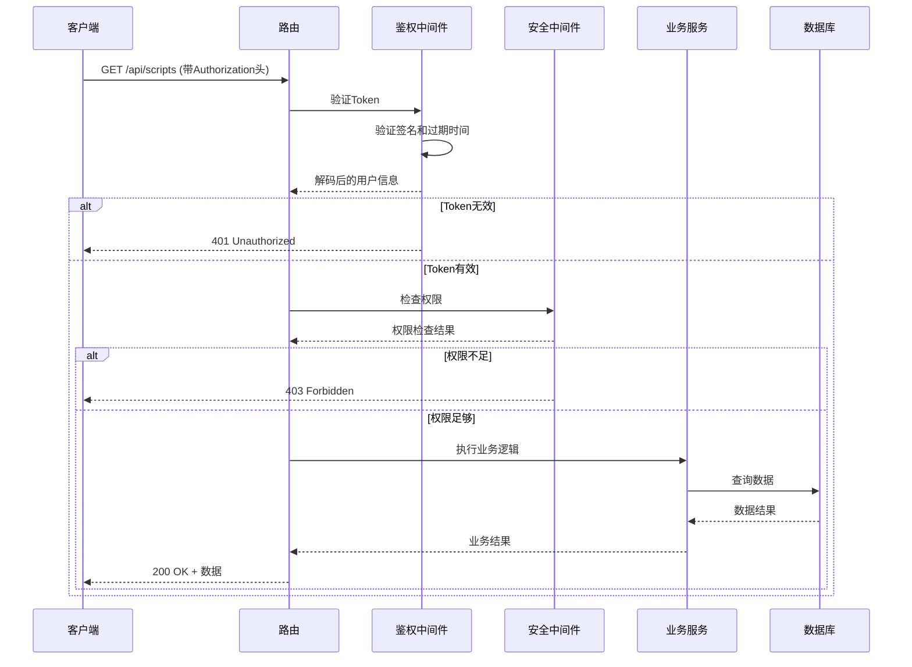
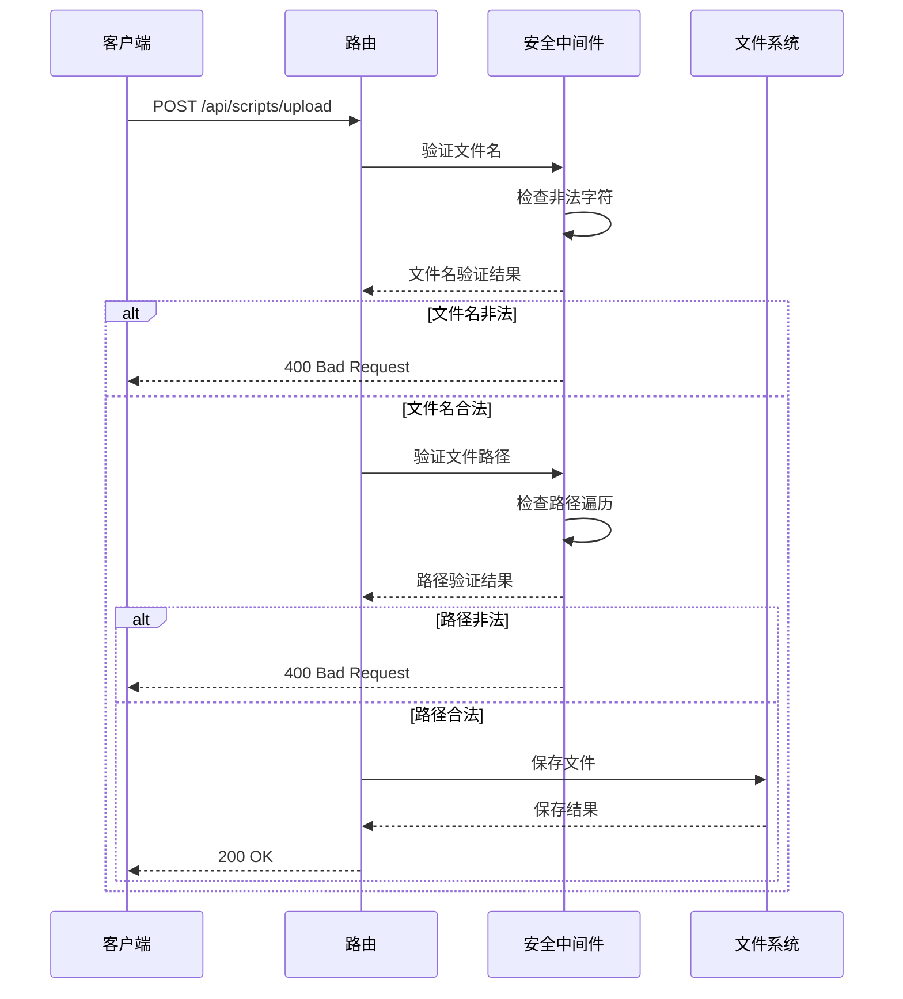
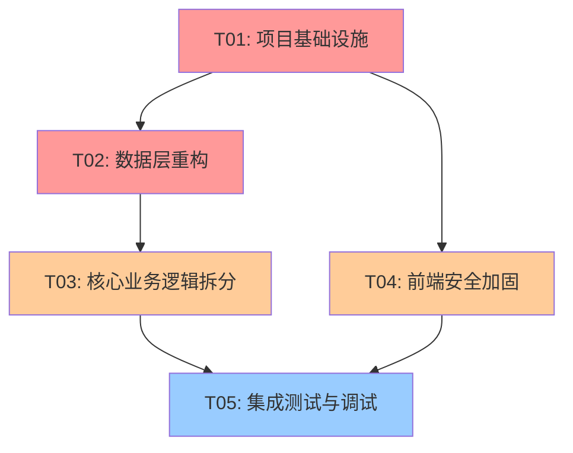

# 智能报告生成工具 - 安全加固与架构优化系统设计

> **设计日期**: 2026-06-23  
> **设计人**: Bob (Architect)  
> **版本**: v1.0  
> **基于**: PROJECT_ASSESSMENT.md v0.3.0

---

## Part A: 系统设计

### 1. 实现方案

#### 1.1 核心技术挑战

| 问题类别 | 具体挑战 | 影响范围 | 技术复杂度 |
|---------|---------|---------|-----------|
| **安全漏洞** | API无鉴权、命令注入、路径遍历、密码存储不安全 | 全局 | 🔴 高 |
| **架构问题** | 单文件后端、JSON并发写、CORS全开放 | 后端核心 | 🟡 中 |
| **前端健壮性** | 无错误边界、API地址硬编码 | 前端全局 | 🟢 低 |

#### 1.2 技术方案选择

**1.2.1 鉴权方案 (JWT)**
- **选择**: `jsonwebtoken` (HMAC-SHA256)
- **理由**: 
  - Node.js生态成熟，文档完善
  - 支持Windows环境
  - 签名/验证性能优秀
  - 无需密钥对管理（对称加密）
- **备选**: `jose` (更现代但学习成本高)

**1.2.2 密码哈希方案**
- **选择**: `bcryptjs` (纯JS实现)
- **理由**:
  - 无需编译，Windows兼容性好
  - 内置盐值生成
  - 抗彩虹表攻击
  - 纯JS实现，部署简单
- **备选**: `argon2` (更安全但需编译原生模块)

**1.2.3 后端框架选择**
- **选择**: 保持原生Node.js http，添加中间件层
- **理由**:
  - 最小化改动，保持向后兼容
  - 避免引入框架迁移风险
  - 通过模块化拆分解决单文件问题
- **备选**: Express/Koa (功能丰富但迁移成本高)

**1.2.4 数据库方案**
- **选择**: 保持JSON文件，添加写入队列
- **理由**:
  - 迁移成本低
  - 满足当前并发需求
  - 后续可平滑迁移到SQLite
- **备选**: SQLite (功能强但需修改所有数据访问代码)

#### 1.3 架构模式

采用**分层架构**，将单文件后端拆分为：

```
┌─────────────────────────────────────┐
│           路由层 (Router)            │
├─────────────────────────────────────┤
│         中间件层 (Middleware)         │
├─────────────────────────────────────┤
│         业务逻辑层 (Service)         │
├─────────────────────────────────────┤
│         数据访问层 (Repository)      │
└─────────────────────────────────────┘
```

### 2. 文件列表

#### 2.1 后端新增文件 (smart-report-server/src/)

| 文件路径 | 用途 | 依赖关系 |
|---------|------|---------|
| `src/config.ts` | 配置常量、环境变量 | 无 |
| `src/middleware/auth.ts` | JWT鉴权中间件 | config.ts |
| `src/middleware/security.ts` | 安全校验中间件（命令注入、路径遍历） | config.ts |
| `src/middleware/cors.ts` | CORS配置中间件 | config.ts |
| `src/utils/db.ts` | 数据库读写工具（含写入队列） | config.ts |
| `src/utils/logger.ts` | 日志工具（含轮转） | config.ts |
| `src/utils/file.ts` | 文件操作工具 | config.ts |
| `src/routes/users.ts` | 用户相关路由 | auth.ts, db.ts |
| `src/routes/scripts.ts` | 脚本管理路由 | auth.ts, security.ts, db.ts |
| `src/routes/templates.ts` | 模板管理路由 | auth.ts, db.ts |
| `src/routes/reports.ts` | 报告生成路由 | auth.ts, security.ts, db.ts |
| `src/routes/conversations.ts` | 对话管理路由 | auth.ts, db.ts |
| `src/services/userService.ts` | 用户业务逻辑 | db.ts |
| `src/services/scriptService.ts` | 脚本业务逻辑 | db.ts, file.ts |
| `src/services/reportService.ts` | 报告生成业务逻辑 | db.ts, file.ts |
| `src/index.ts` | 主入口（重构后） | 所有模块 |

#### 2.2 前端修改文件 (smart-report-tool/src/)

| 文件路径 | 修改内容 |
|---------|---------|
| `src/services/api.ts` | 添加JWT token处理、环境变量配置 |
| `src/stores/authStore.ts` | Token存储、刷新逻辑 |
| `src/App.tsx` | 添加ErrorBoundary |
| `src/components/ErrorBoundary.tsx` | 新增：全局错误边界组件 |
| `src/vite-env.d.ts` | 环境变量类型定义 |

#### 2.3 配置文件

| 文件路径 | 用途 |
|---------|------|
| `smart-report-server/.env.example` | 环境变量示例 |
| `smart-report-tool/.env.example` | 前端环境变量示例 |
| `smart-report-server/package.json` | 更新依赖 |

### 3. 数据结构和接口

#### 3.1 核心类图



#### 3.2 用户数据结构

```typescript
interface User {
  id: string;
  username: string;
  passwordHash: string;  // bcrypt哈希
  salt: string;          // bcrypt自动生成
  role: 'admin' | 'senior' | 'member';
  status: 'pending' | 'active' | 'disabled';
  createdAt: string;
  updatedAt: string;
  lastLoginAt?: string;
  loginAttempts: number;
  lockUntil?: string;
}

interface TokenPayload {
  userId: string;
  username: string;
  role: string;
  iat: number;
  exp: number;
}
```

### 4. 程序调用流程

#### 4.1 用户登录流程



#### 4.2 受保护API调用流程



#### 4.3 安全文件操作流程



### 5. 不明确事项

1. **JWT密钥管理**: 生产环境如何安全存储JWT_SECRET？
   - 建议: 使用环境变量或密钥管理服务
   
2. **Token刷新策略**: 是否需要实现Refresh Token？
   - 建议: 当前版本使用单Token，过期后重新登录

3. **日志轮转策略**: 按大小还是按时间轮转？
   - 建议: 按大小(10MB)轮转，保留最近10个文件

4. **密码策略**: 是否需要强制密码复杂度？
   - 建议: 至少8位，包含大小写字母和数字

5. **并发控制**: 写入队列的最大并发数？
   - 建议: 单线程写入，保证数据一致性

---

## Part B: 任务分解

### 6. 依赖包列表

```json
{
  "dependencies": {
    "jsonwebtoken": "^9.0.0",
    "bcryptjs": "^2.4.3",
    "dotenv": "^16.3.1"
  },
  "devDependencies": {
    "@types/jsonwebtoken": "^9.0.1",
    "@types/bcryptjs": "^2.4.2"
  }
}
```

### 7. 任务列表 (按依赖排序)

#### **T01: 项目基础设施 (P0)**
- **任务描述**: 搭建安全架构基础，实现配置管理和基础中间件
- **包含文件**:
  - `smart-report-server/src/config.ts`
  - `smart-report-server/src/middleware/auth.ts`
  - `smart-report-server/src/middleware/security.ts`
  - `smart-report-server/src/middleware/cors.ts`
  - `smart-report-server/src/utils/logger.ts`
  - `smart-report-server/.env.example`
  - `smart-report-server/package.json` (更新依赖)
- **依赖**: 无
- **复杂度**: 中
- **预计工时**: 4小时

#### **T02: 数据层重构 (P0)**
- **任务描述**: 实现安全的数据库操作和文件工具
- **包含文件**:
  - `smart-report-server/src/utils/db.ts`
  - `smart-report-server/src/utils/file.ts`
- **依赖**: T01
- **复杂度**: 高
- **预计工时**: 6小时

#### **T03: 核心业务逻辑拆分 (P1)**
- **任务描述**: 将单文件后端拆分为模块化的路由和服务
- **包含文件**:
  - `smart-report-server/src/routes/users.ts`
  - `smart-report-server/src/routes/scripts.ts`
  - `smart-report-server/src/routes/templates.ts`
  - `smart-report-server/src/routes/reports.ts`
  - `smart-report-server/src/routes/conversations.ts`
  - `smart-report-server/src/services/userService.ts`
  - `smart-report-server/src/services/scriptService.ts`
  - `smart-report-server/src/services/reportService.ts`
- **依赖**: T02
- **复杂度**: 高
- **预计工时**: 8小时

#### **T04: 前端安全加固 (P1)**
- **任务描述**: 实现前端鉴权、错误处理和配置管理
- **包含文件**:
  - `smart-report-tool/src/services/api.ts` (修改)
  - `smart-report-tool/src/stores/authStore.ts` (修改)
  - `smart-report-tool/src/components/ErrorBoundary.tsx` (新增)
  - `smart-report-tool/src/App.tsx` (修改)
  - `smart-report-tool/.env.example`
- **依赖**: T01 (需要JWT格式)
- **复杂度**: 中
- **预计工时**: 4小时

#### **T05: 集成测试与调试 (P2)**
- **任务描述**: 整合所有模块，进行端到端测试和调试
- **包含文件**:
  - `smart-report-server/src/index.ts` (重构主入口)
  - 测试脚本和文档
- **依赖**: T03, T04
- **复杂度**: 中
- **预计工时**: 6小时

### 8. 共享知识

#### 8.1 API响应格式
```typescript
interface ApiResponse<T> {
  code: number;      // HTTP状态码
  data: T;           // 响应数据
  message: string;   // 响应消息
  error?: string;    // 错误详情(仅错误时)
}
```

#### 8.2 JWT Token格式
```
Header: { "alg": "HS256", "typ": "JWT" }
Payload: { 
  "userId": "uuid", 
  "username": "string", 
  "role": "admin|senior|member",
  "iat": timestamp,
  "exp": timestamp 
}
Signature: HMACSHA256(base64(header) + "." + base64(payload), secret)
```

#### 8.3 安全规则
- **文件名**: 仅允许 `[a-zA-Z0-9_\-.]`，长度限制255字符
- **文件路径**: 必须在允许的目录白名单内，禁止`..`遍历
- **密码**: bcrypt哈希，成本因子12
- **CORS**: 仅允许配置的前端域名

#### 8.4 错误码定义
```typescript
enum ErrorCode {
  UNAUTHORIZED = 401,
  FORBIDDEN = 403,
  NOT_FOUND = 404,
  VALIDATION_ERROR = 400,
  INTERNAL_ERROR = 500
}
```

### 9. 任务依赖图



---

## 风险评估

### 高风险改动
1. **JWT鉴权实现** - 影响所有API，需全面测试
2. **数据库写入队列** - 可能引入死锁或性能问题
3. **文件路径校验** - 可能误判合法路径

### 中风险改动
1. **CORS配置** - 可能阻断合法跨域请求
2. **密码哈希迁移** - 需要处理旧密码兼容

### 低风险改动
1. **前端ErrorBoundary** - 仅影响错误展示
2. **日志轮转** - 独立模块，影响范围小

### 回滚方案
1. **代码回滚**: 使用Git版本控制，可快速回退
2. **数据库备份**: 升级前备份db.json
3. **渐进式发布**: 先在测试环境验证
4. **功能开关**: 通过环境变量控制新功能启用

### 平滑升级策略
1. **密码哈希迁移**: 登录时自动升级旧密码哈希
2. **Token兼容**: 新旧Token并行期（可选）
3. **API版本控制**: 保持旧API可用一段时间

---

## 总结

本设计方案采用**渐进式改进**策略，在最小化改动的前提下解决所有高优先级安全问题。通过模块化拆分提升代码可维护性，同时保持向后兼容性。建议按T01→T02→T03→T04→T05的顺序实施，总预计工时28小时。